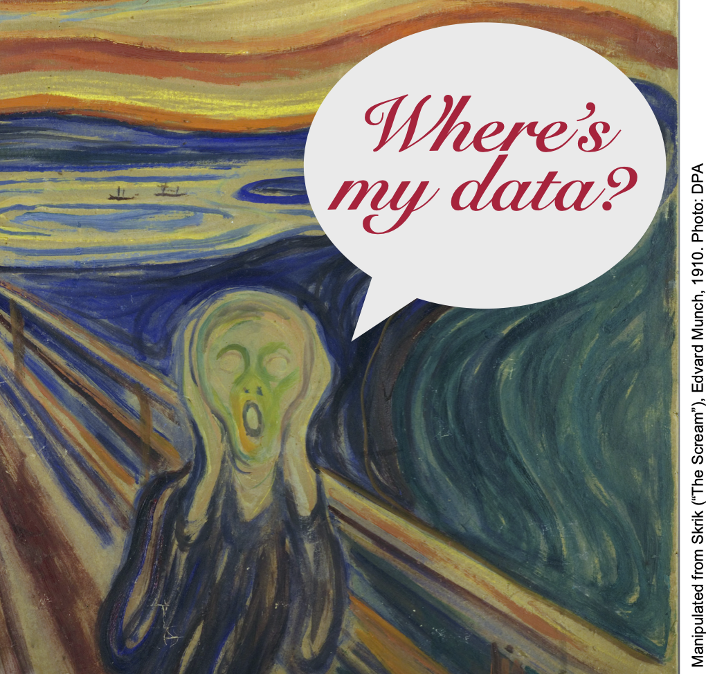
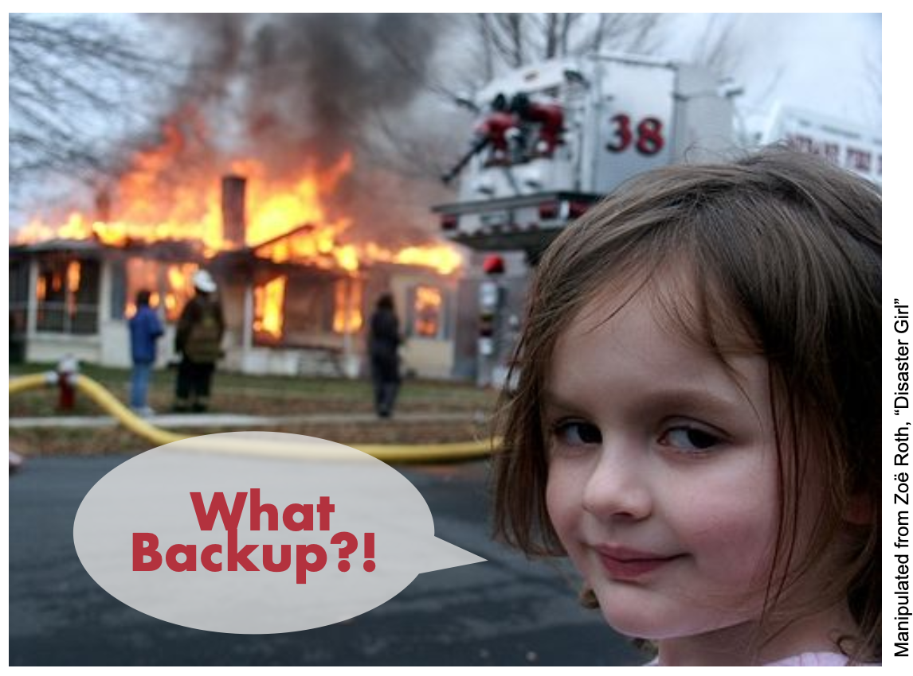
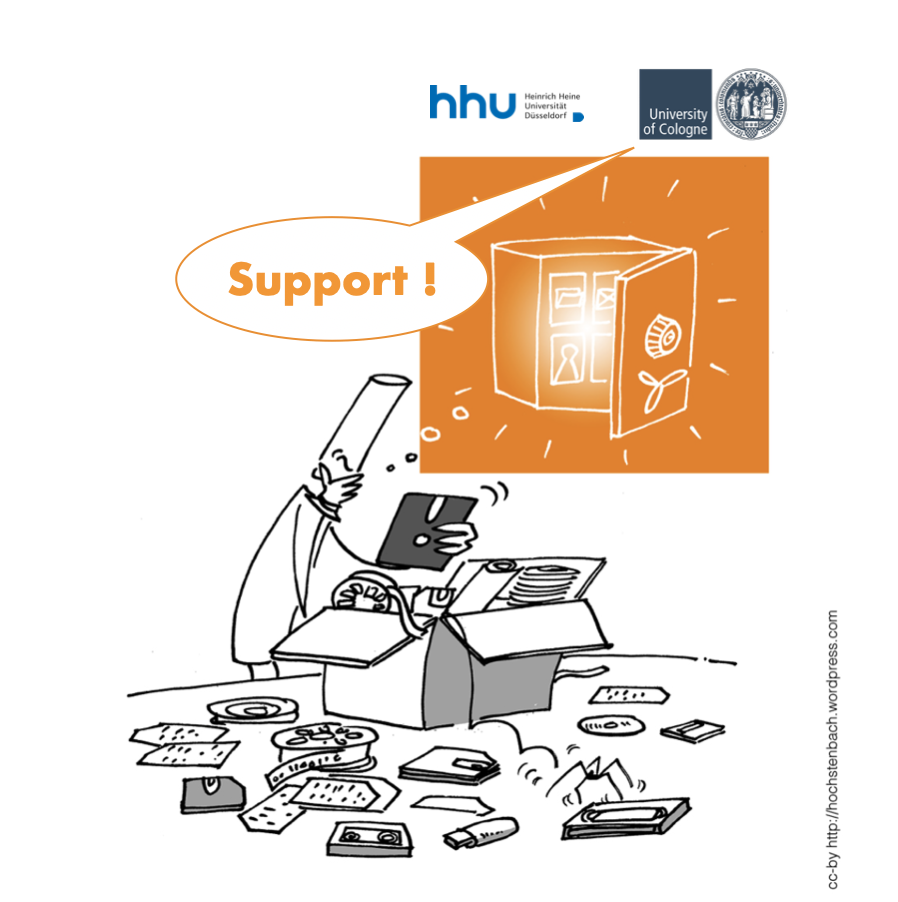
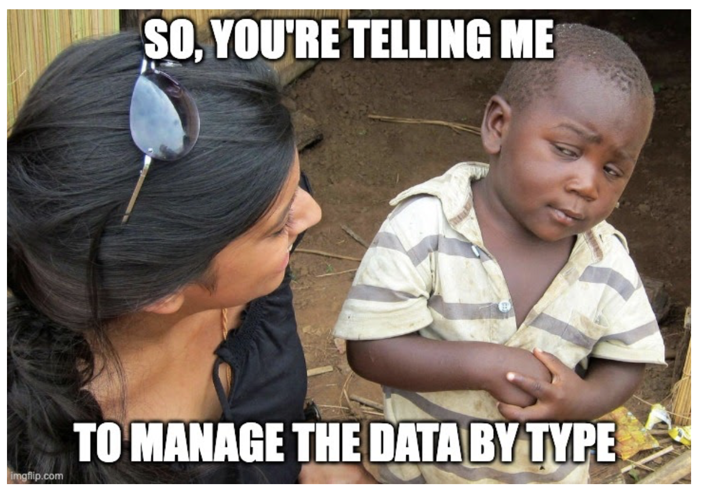

# Workshop series: Friday FAIRday 2021

## Materials 

Session  |  Slides | Supplementary Materials |
------------ | ------------- | ------------- |
Session I    | [Directory structures and file naming](20210611_PRE_DirectoryStructureFileNaming.pdf) | <ul><li>[WorkSheet for designing a filenaming convention](SUP_DirectoryStructureFileNaming/WorkSheet_DirectoryStructureFileNaming.docx)</li><li>[Template for creating readme](SUP_DirectoryStructureFileNaming/Template_README_DirectoryStructureFileNaming.pdf)</li><li>[Notes](SUP_DirectoryStructureFileNaming/Notes_DirectoryStructureFileNaming.pdf)</li><li>[CheckList for naming](SUP_DirectoryStructureFileNaming/Checklist_DirectoryStructureFileNaming.pdf)</ul>|
Session II    | [Data Storage and Backup](20210702_PRE_DataStorageBackupArchive.pdf) | <ul><li>[Notes](SUP_DataStorageBackupArchive/Notes_DataStorageBackup.pdf)</li><li>[Checklist for Data Store, Backup & Archiving](SUP_DataStorageBackupArchive/Checklist_DataStorageBackup.pdf)</li></ul>|
Session III    | [Institutional Services](https://github.com/CEPLAS-FAIRidise/Friday-FAIRday-2021/blob/main/20210903_PRE_UzK_Services.pdf)|[Notes]|
Session IV    | [Institutional Services](https://github.com/CEPLAS-FAIRidise/Friday-FAIRday-2021/blob/main/20211105_PRE_DataTypes.pdf)|[Notes]|

----

## About this workshop

We offer this data management workshop series about organizing research and project data. The workshops are open to everyone. The sessions are independent and we welcome you to join any topic of your interest.
Kindly feel free to contact us with any questions, feedback or topic requests.

## Topics
Upcoming topics and dates will be announced via CEPLAS leaflet and CEPLAS Fridays 

## Date
First Friday of the month | 2 – 2:30 pm (+ open end for discussion)

## Registration link
[Please join us via Zoom](https://uni-koeln.zoom.us/meeting/register/tJIoceqprzktGdGIuwRjp6elVQo5an-TnDmF)
